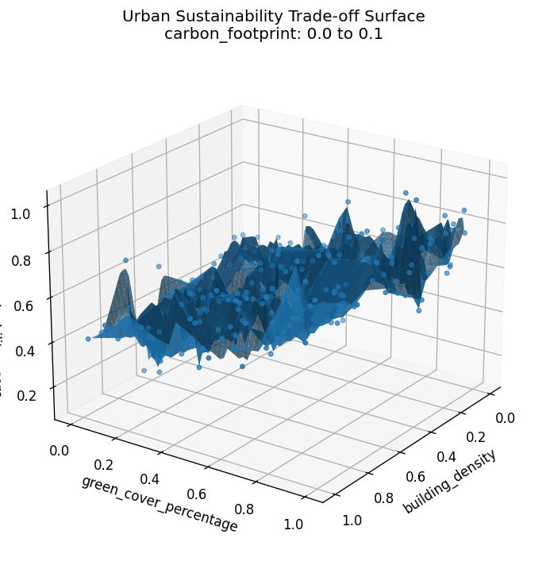

# Urban Sustainability Score  
### Drivers, Trade-offs, and Scenario Simulation

This project examines how urban form, infrastructure, environmental, and socio-economic drivers interact to shape an overall urban sustainability score.

It combines predictive modeling, trade-off analysis, and interactive scenario simulation to support exploratory and policy-relevant insights.

## Model Trade-offs and Interaction Effects

## Interactive Scenario Simulator

An interactive Streamlit dashboard allows users to adjust key urban drivers and observe real-time changes in predicted sustainability outcomes.

[Launch the Scenario Simulator →](https://urban-sustainability-score-drivers-trade-offs-and-scenario-sim.streamlit.app/)
